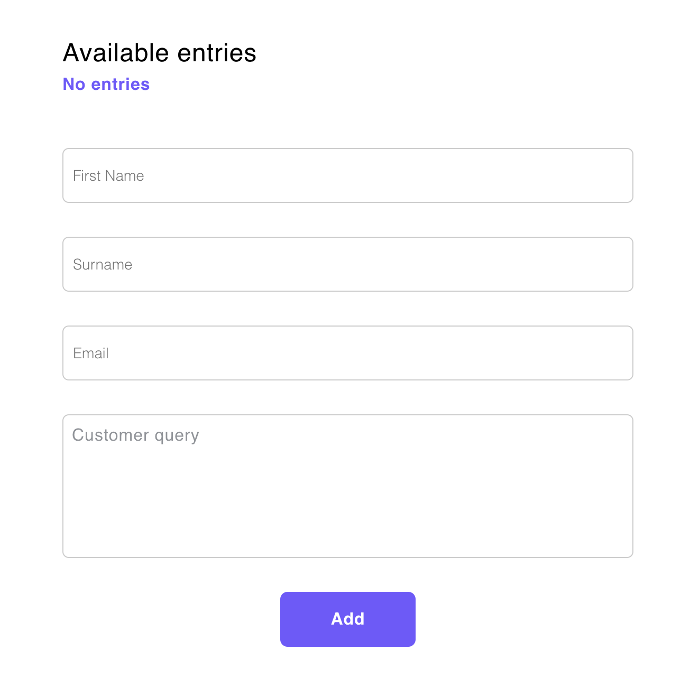

# Maroua vuex form

Simple vue page. Form data handled using vuex and a simple store with no modules, to keep it simple and straight forward.

Used vue cli 3 to generate the project.
Normalize scss to reset css.
I prefered not to use any frontend UI framework, because is a quite simple form and I enjoyed more to do my own.

I've Used global reusable components for good practice, actions are dispatched from the parent view.
main.scss imports variables, normalize etc


-----

## Project setup
```
yarn install
```
### Compiles and hot-reloads for development
```
yarn run dev
```

### Compiles and minifies for production
```
yarn run build
```

### Customize configuration
See [Configuration Reference](https://cli.vuejs.org/config/).
